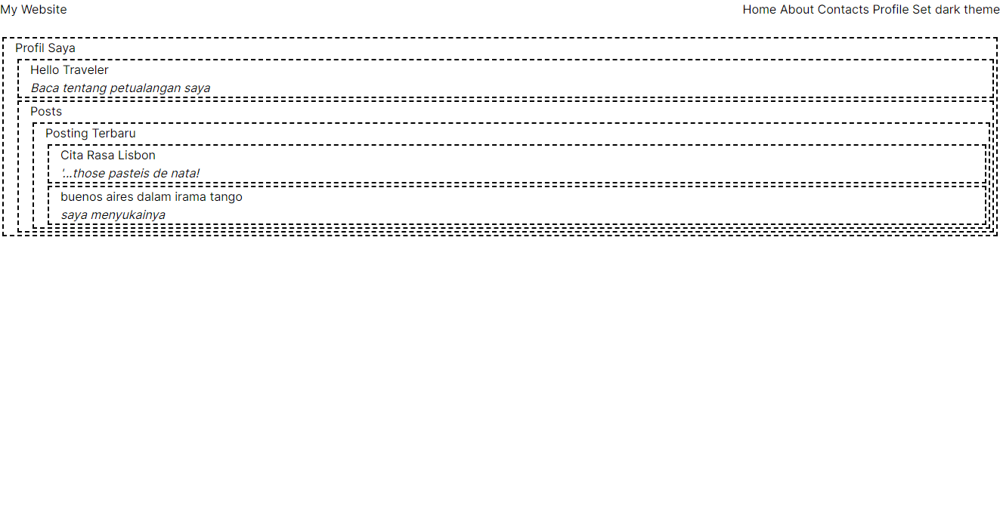
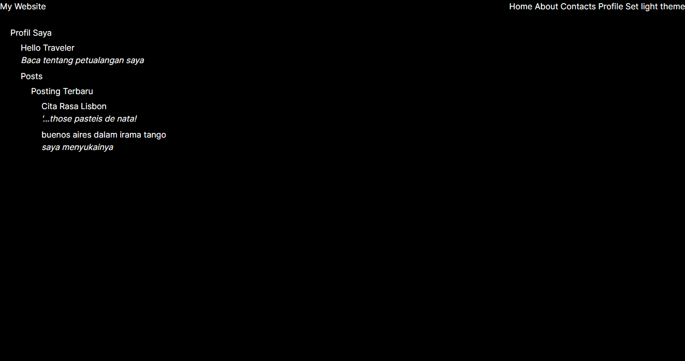

Praktikum 1 

Capture hasilnya dan buatlah laporan di README.md. Jelaskan apa yang telah Anda pelajari dan bagaimana tampilannya saat ini?
Jawaban:

struktur file dan folder yang umum digunakan dalam proyek React. Ini meliputi pembuatan komponen dalam folder terpisah seperti components dan penggunaan subfolder untuk mengelompokkan jenis komponen tertentu, seperti atoms untuk komponen-komponen dasar dan juga memplejari ara membuat komponen React, baik itu komponen sederhana seperti Heading dan Section, maupun komponen yang lebih kompleks seperti MainPage

Jangan lupa push dengan pesan commit: "W07: Jawaban soal 1".

Soal 2
Capture hasilnya dan buatlah laporan di README.md. Jelaskan apa yang telah Anda pelajari dan bagaimana tampilannya saat ini?

Jika terjadi error, silakan perbaiki, Mengapa hal itu bisa terjadi? Jelaskan!
[alt text](image2-1.png)

Jangan lupa push dengan pesan commit: "W07: Jawaban soal 2".

Soal 3
Capture hasilnya dan buatlah laporan di README.md. Jelaskan apa yang telah Anda pelajari dan bagaimana tampilannya saat ini?

Jangan lupa push dengan pesan commit: "W07: Jawaban soal 3".

Soal 4
Capture hasilnya dan buatlah laporan di README.md. Tambahkan teks Nama dan NIM pada bagian komponen Post agar menunjukkan itu hasil kerja Anda!

Jangan lupa push dengan pesan commit: "W07: Jawaban soal 4".

Soal 5

Silakan save semua dan lakukan running di browser Anda. Capture hasilnya dan buatlah laporan di README.md. Tambahkan teks Nama dan NIM pada setiap page routing agar menunjukkan itu hasil kerja Anda sendiri!

Apakah toggle button tema sudah berfungsi ? jika belum, silakan perbaiki!

Mengapa ketika refresh atau berpindah halaman tema tidak permanen ? Buatlah menjadi permanen walaupun page sudah direfresh dan pindah halaman!
Jangan lupa push dengan pesan commit: "W07: Jawaban soal 5".
