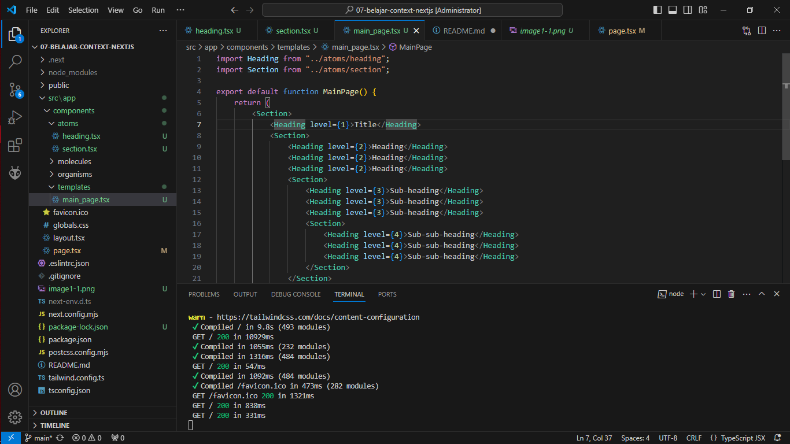
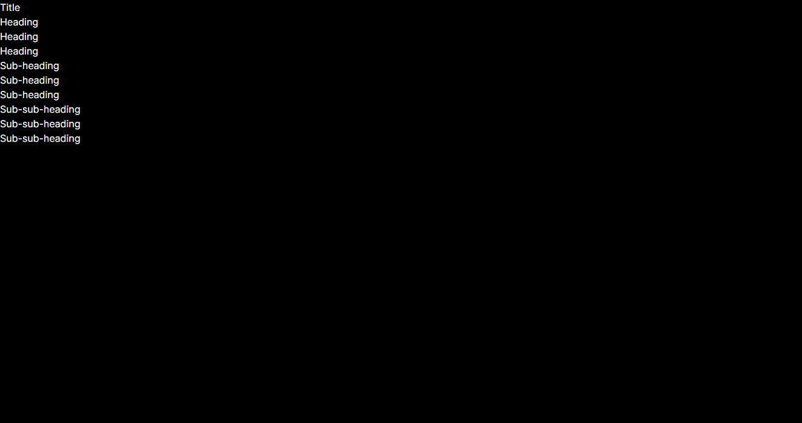

Praktikum 1 

Capture hasilnya dan buatlah laporan di README.md. Jelaskan apa yang telah Anda pelajari dan bagaimana tampilannya saat ini?
Jawaban:

struktur file dan folder yang umum digunakan dalam proyek React. Ini meliputi pembuatan komponen dalam folder terpisah seperti components dan penggunaan subfolder untuk mengelompokkan jenis komponen tertentu, seperti atoms untuk komponen-komponen dasar dan juga memplejari ara membuat komponen React, baik itu komponen sederhana seperti Heading dan Section, maupun komponen yang lebih kompleks seperti MainPage

Jangan lupa push dengan pesan commit: "W07: Jawaban soal 1".